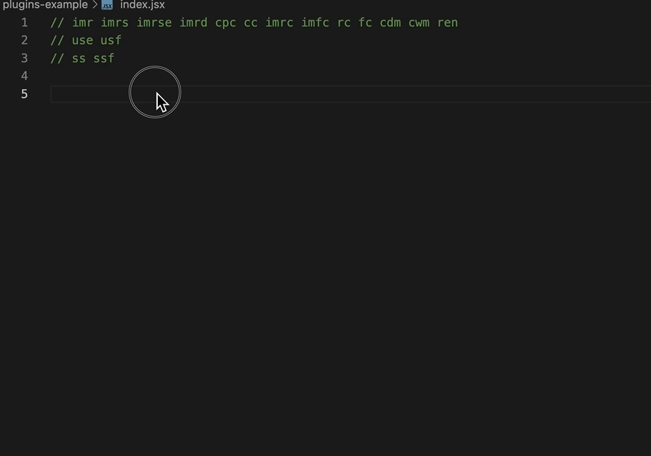
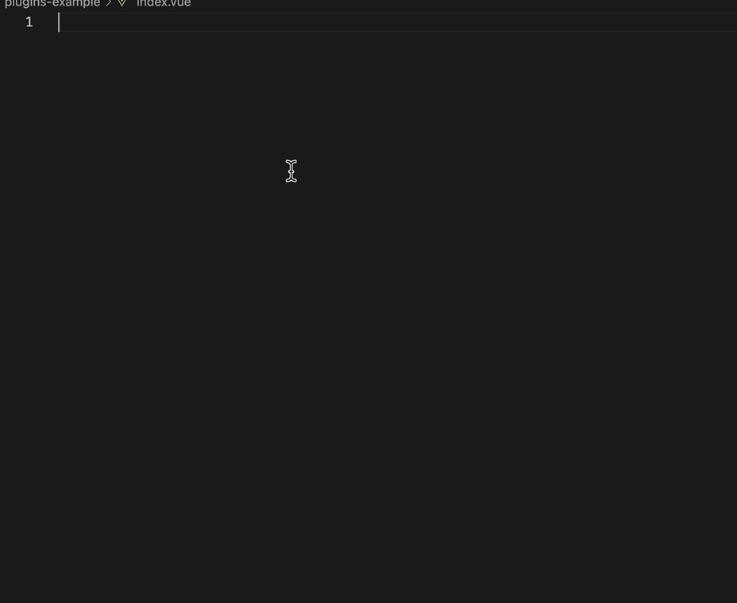
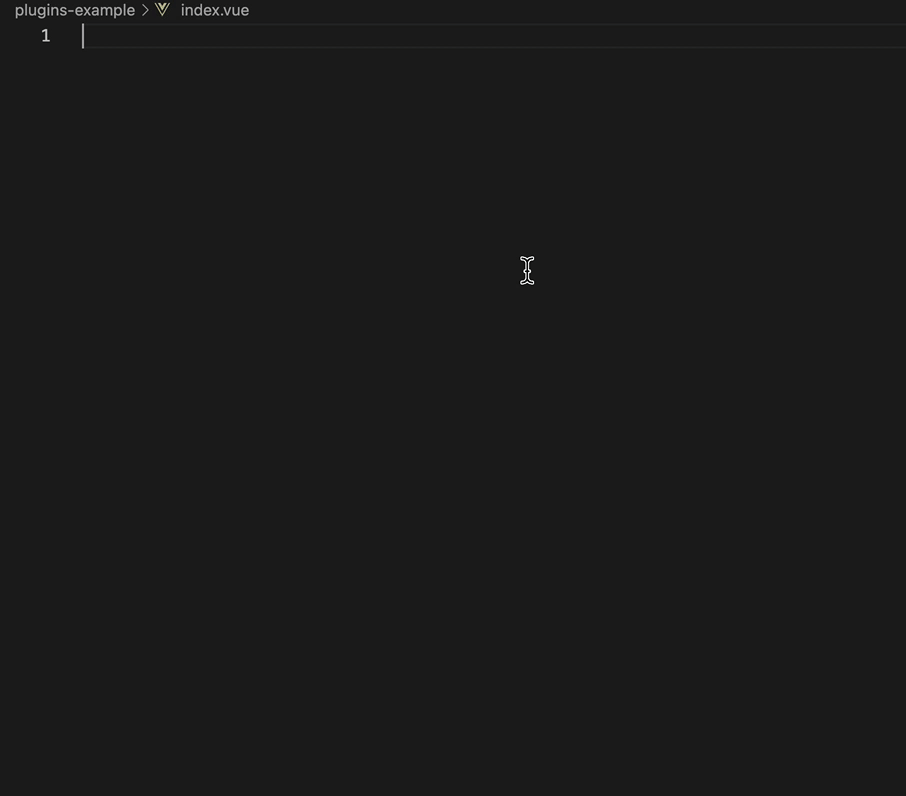
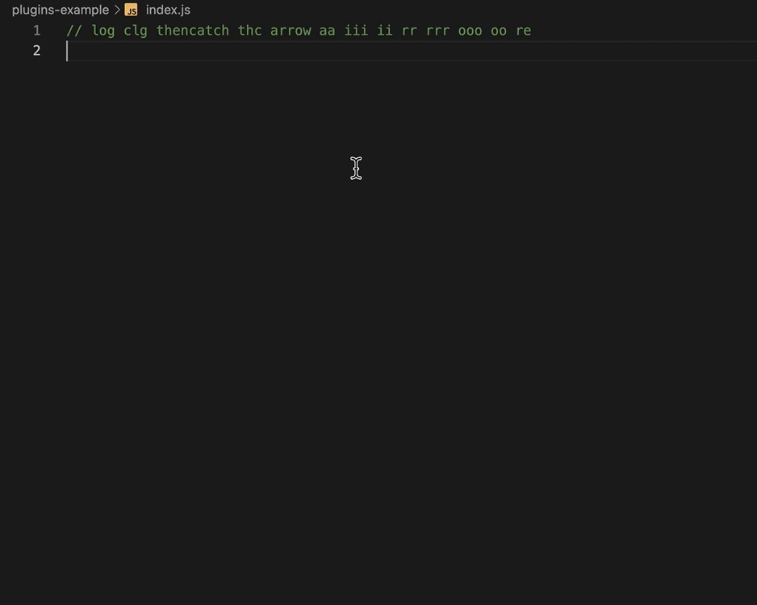
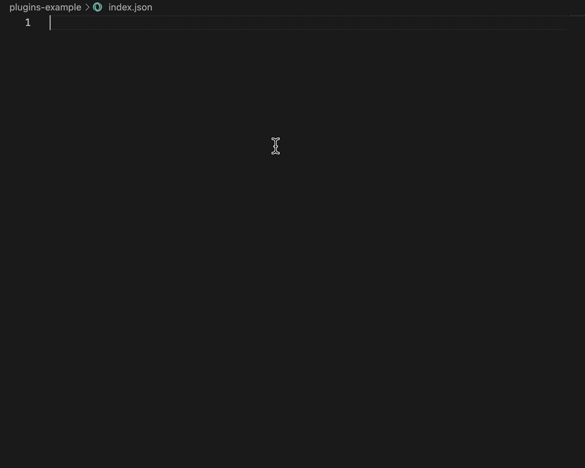

# Snippets For React/Vue/JS/TS

一个Snippets插件集成了市面上安装量较大的Vue 3 Snippets、Simple React Snippets，另新增一些常用js、ts语法的snippets

## Features

下面简单介绍一下可使用的`snippets`有哪些

* 在`React`文件中

---

* 在`Vue`文件中

---

* 在`js/ts`文件中

---

* 在`json`文件中

## Known Issues

暂无

## Release Notes

### 1.0.0

初始化`React Snippets`、`Vue 2 Snippets`、`JS`、`TS`

---

**快来尝试下吧!**

